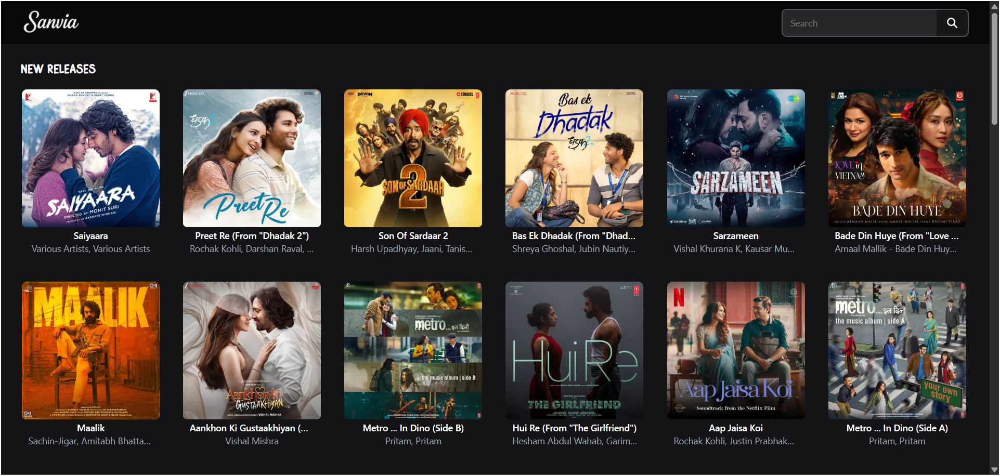
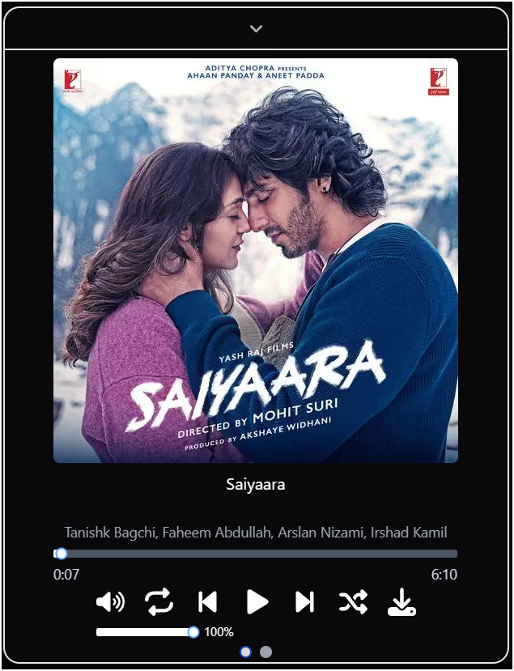
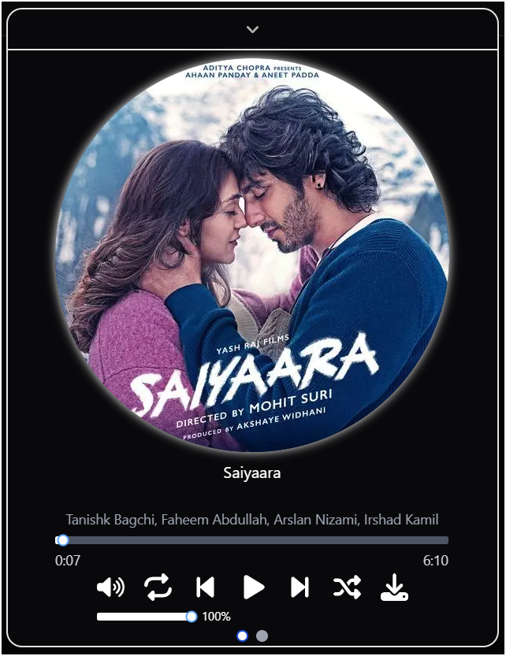
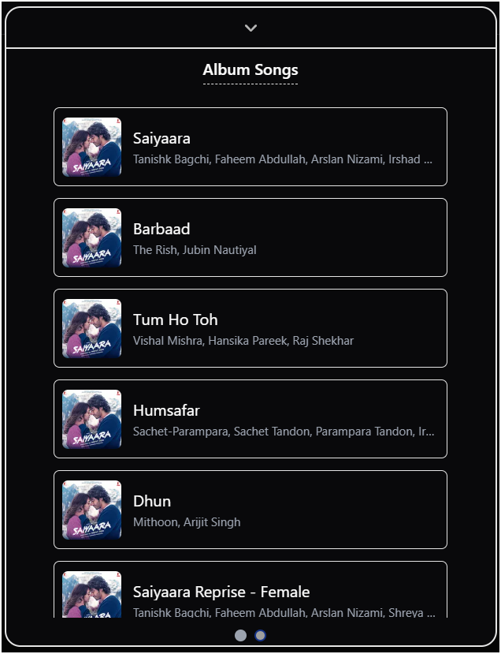
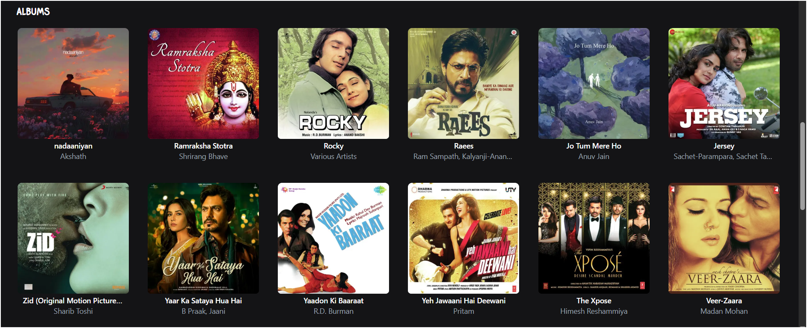
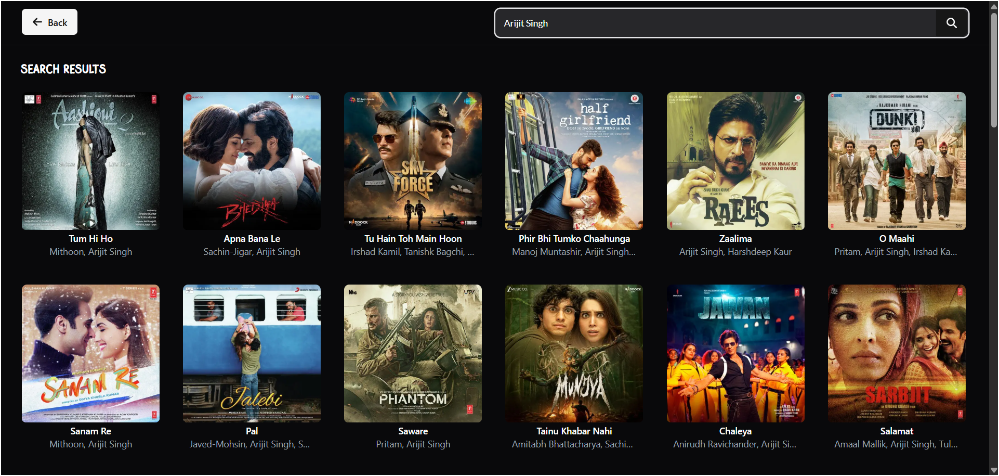

# 🎵 Sanvia - Music Streaming Web App


**Sanvia** is a sleek, modern, and responsive music streaming web application inspired by [JioSaavn](https://www.jiosaavn.com/). It delivers a smooth, high-performance music experience across devices, built using the latest web technologies including **Next.js 14**, **Tailwind CSS**, and **ShadCN UI**.

> **Sanvia** – “A musical path inspired by someone special.”  
> A hidden tribute to **_*******_**  
> _Softening the name to **San**, and adding **via** to express the journey of love, sound, and emotion._

> Powered by the unofficial JioSaavn API.

---

## 🚀 Features

### 🎧 New Releases


- Display of the latest music songs/albums.
- Clickable music cards to start playing instantly.

---

### 🎶 Interactive Music Player




- Fully featured bottom music player with a clean and minimal design.
- Controls include: play/pause, seek, volume, repeat, shuffle, and download.
- Double click on image for `Rotating disc animation` while a song is playing.
- Smart content rendering in the second UI of player:
  - **If a song is selected**: Suggest similar or related songs based on genre, artist, or popularity.
  - **If an album is selected**: Display the full list of songs from that album.
  - **If an artist is selected**: Show all available songs by that artist.

---

### 📜 Album Details


- View the full list of random albums.
- Instantly play from the album view.

---

### 🔍 Search Functionality with Pagination


- Search songs by artist or song name.
- Pagination with **“Load More”** button to fetch and display additional results seamlessly.

---

## 🛠️ Tech Stack

- **Framework**: Next.js 14
- **Styling**: Tailwind CSS
- **UI Components**: ShadCN UI
- **API**: Unofficial [JioSaavn API](https://saavn.dev/docs)

---

## 📦 Local Development

```bash
git clone https://github.com/Dileep01712/Sanvia.git
cd sanvia
npm install
npm run dev
